[](https://pypi.org/project/SimplestSimulatedAnnealing/)

# Simplest simulated annealing

Simplest implementation of simulated annealing method

```
pip install SimplestSimulatedAnnealing
```

- [Simplest simulated annealing](#simplest-simulated-annealing)
  - [Idea of method](#idea-of-method)
  - [Simple usage](#simple-usage)
  - [Parameters of method](#parameters-of-method)
  - [Temperature regimes](#temperature-regimes)
    - [Pattern](#pattern)
    - [Available functions](#available-functions)
    - [Plot temperature](#plot-temperature)
    - [Difference between coolings](#difference-between-coolings)
    - [Multiple coolings](#multiple-coolings)
    - [Give a change to multiple coolings](#give-a-change-to-multiple-coolings)
  - [About mutation](#about-mutation)
- [Examples](#examples)
  - [Select best subset](#select-best-subset)
  - [Travelling salesman problem](#travelling-salesman-problem)

## Idea of method

This is the evolutionary algorithm for *function minimization*. Steps of algorithm:
1. We should determine function `f` must be minimized
2. Determine start solution `x0` (can be random)
3. Determine mutation function `mut`. This function should give new (can be random) `x1` solution using information about `x0` and temperature `T`.
4. Select or create `cooling` regime(s) (temperature behavior)
5. Set start temperature(s) `T`
6. Run searching:
   * at start we have `x0` solution and `f(x0)` best score
   * let's create mutant `x1 = mut(x0)` and calculate `f(x1)`
   * if `f(x1) < f(x0)`, we found better solution `x0 = x1`. Otherwise we can replace `x1` with `x0` with probability equals `exp((f(x0) - f(x1)) / T)`
   * decrease `T` using `cooling` function: `T = cooling(T)`
   * repeat last 3 steps until stop criterion 

## Simple usage

Import packages:

```python
import math
import numpy as np

from SimplestSimulatedAnnleaning import SimulatedAnnealing, Cooling, simple_continual_mutation
```

Determine minimized function (Rastrigin):

```python
def Rastrigin(arr):
    return 10*arr.size+np.sum(arr**2) - 10*np.sum(np.cos(2*math.pi*arr))

dim = 5
```
We will use simplest gauss mutation:

```python
mut = simple_continual_mutation(std = 0.5)
```

Create model object (set function and dimension):

```python
model = SimulatedAnnealing(Rastrigin, dim)
```

Start searching and see report:

```python
best_solution, best_val = model.run(
    start_solution = np.random.uniform(-5, 5, dim),
    mutation = mut,
    cooling = Cooling.exponential(0.9), 
    start_temperature = 100, 
    max_function_evals = 1000, 
    max_iterations_without_progress = 100, 
    step_for_reinit_temperature = 80
    )

model.plot_report(save_as = 'simple_example.png')
```

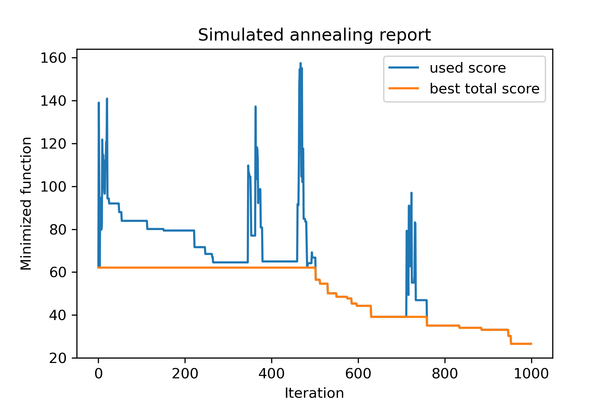

## Parameters of method

Main method of the package is `run()`. Let's check it's arguments:

```python
model.run(start_solution, 
          mutation, 
          cooling, 
          start_temperature, 
          max_function_evals = 1000, 
          max_iterations_without_progress = 250, 
          step_for_reinit_temperature = 90,
          reinit_from_best = False,
          seed = None)
```

Where:
* `start_solution` : numpy array; solution from which it should start.
* `mutation` : function (array, array/number). Function like
  ```python
  def mut(x_as_array, temperature_as_array_or_one_number):
      # some code
      return new_x_as_array
  ```
    This function will create new solutions from existing. [See also](#about-mutation)

* `cooling` : cooling function / functions list. Cooling function or a list of ones. [See](#temperature-regimes)

* `start_temperature` : number or number array (list/tuple). Start temperatures. Can be one number or an array of numbers.

* `max_function_evals` : int, optional. Maximum number of function evaluations. The default is 1000.
* `max_iterations_without_progress` : int, optional. Maximum number of iterations without global progress. The default is 250.
* `step_for_reinit_temperature` : int, optional. After this number of iterations without progress temperatures will be initialized as like start. The default is 90.
* `reinit_from_best` : boolean, optional. Start algorithm from best solution after reinit temperatures (or from last current solution). The default is False.
* `seed` : int/None, optional. Random seed (if needed)

## Temperature regimes

### Pattern

The important part of algorithm is **cooling function**. This function controls temperature value depended on current iteration number, current temperature and start temperature. U can create your own cooling function using pattern:

```python
def func(T_last, T0, k):
    # some code
    return T_new
```

Here `T_last` (int/float) is the temperature value from previous iteration, `T0` (int/float) is the start temperature and `k` (int > 0) is the number of iteration. U should use some of this information to create new temperature `T_new`. 

It's highly recommended to build your function to create only positive temperature. 

### Available functions

In `Cooling` class there are several cooling functions:
* `Cooling.linear(mu, Tmin = 0.01)`
* `Cooling.exponential(alpha = 0.9)`
* `Cooling.reverse(beta = 0.0005)`
* `Cooling.logarithmic(c, d = 1)` - not recommended
* `Cooling.linear_reverse()`

### Plot temperature

U can see the behavior of cooling function using `SimulatedAnnealing.plot_temperature` method. Let's see several examples: 

```python
from SimplestSimulatedAnnleaning import SimulatedAnnealing, Cooling


# simplest way to set cooling regime
temperature = 100
cooling = Cooling.reverse(beta = 0.001)
# we can temperature behaviour using this code
SimulatedAnnealing.plot_temperature(cooling, temperature, iterations = 100, save_as = 'reverse.png')
```
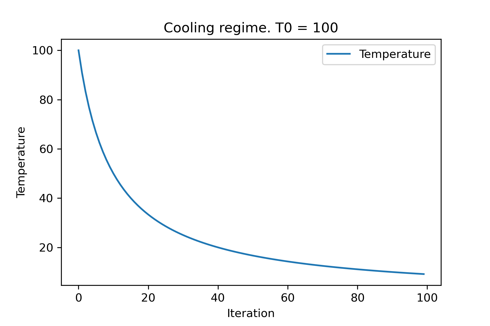


```python
# we can set several temparatures (for each dimention)
temperature = [150, 100, 50]
SimulatedAnnealing.plot_temperature(cooling, temperature, iterations = 100, save_as = 'reverse_diff_temp.png')
```
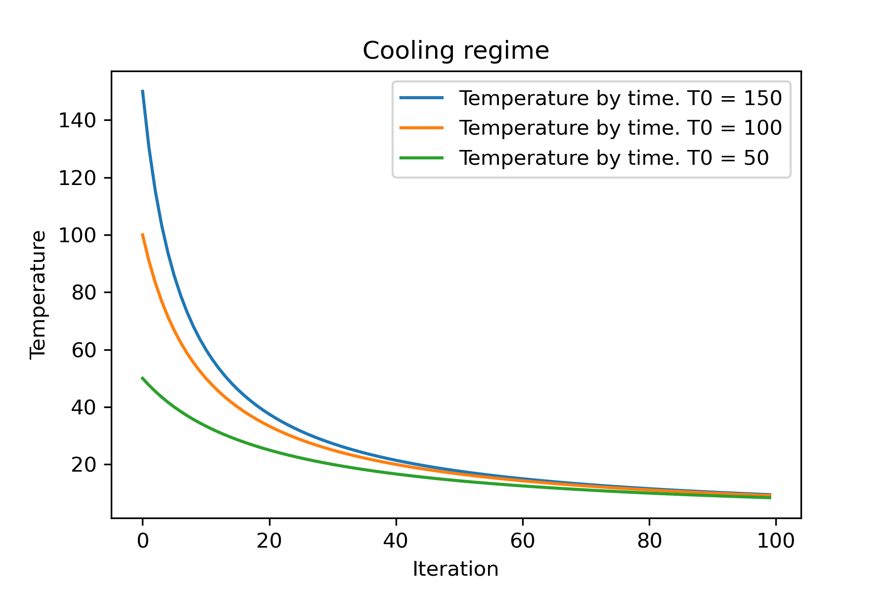


```python
# or several coolings (for each dimention)
temperature = 100
cooling = [
    Cooling.reverse(beta = 0.0001),
    Cooling.reverse(beta = 0.0005),
    Cooling.reverse(beta = 0.001)
    ]
SimulatedAnnealing.plot_temperature(cooling, temperature, iterations = 100, save_as = 'reverse_diff_beta.png')
```
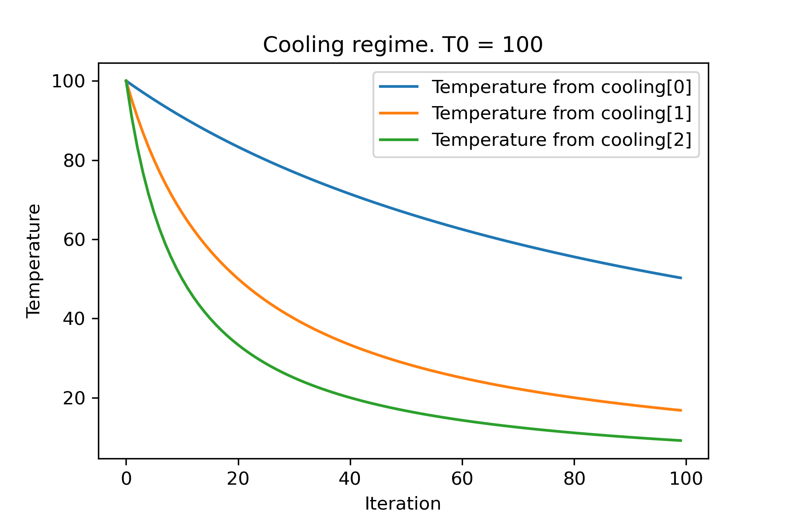


```python
# all supported coolling regimes

temperature = 100
cooling = [
    Cooling.linear(mu = 1),
    Cooling.reverse(beta = 0.0007),
    Cooling.exponential(alpha = 0.85),
    Cooling.linear_reverse(),
    Cooling.logarithmic(c = 100, d = 1)
    ]
SimulatedAnnealing.plot_temperature(cooling, temperature, iterations = 100, save_as = 'diff_temp.png')
```
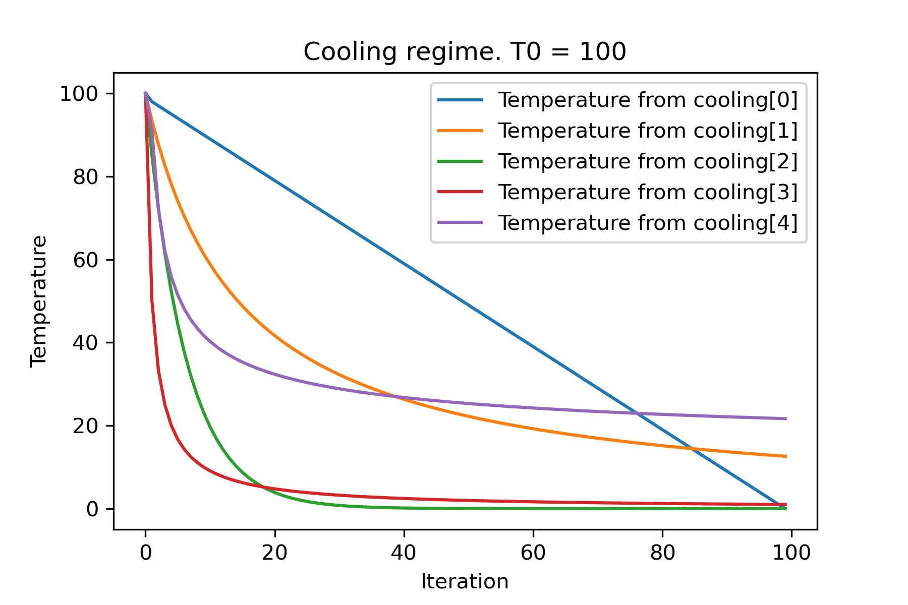


```python
# and we can set own temperature and cooling for each dimention!

temperature = [100, 125, 150]
cooling = [
    Cooling.exponential(alpha = 0.85),
    Cooling.exponential(alpha = 0.9),
    Cooling.exponential(alpha = 0.95),
    ]
SimulatedAnnealing.plot_temperature(cooling, temperature, iterations = 100, save_as = 'diff_temp_and_cool.png')
```
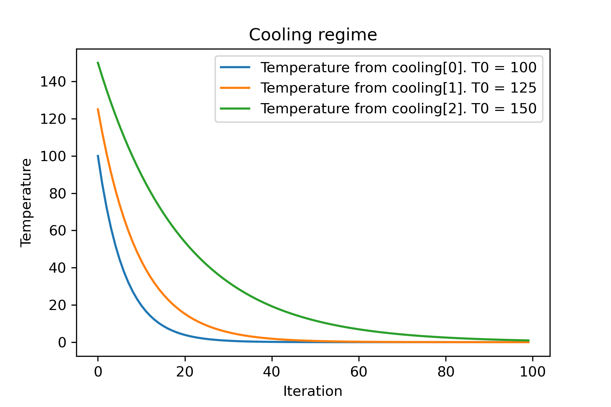


### Difference between coolings

Why there are so many cooling regimes? For certain task one of them can be such better! In [this script](tests/regimes_temp.py) we can test different cooling for Rastring function:

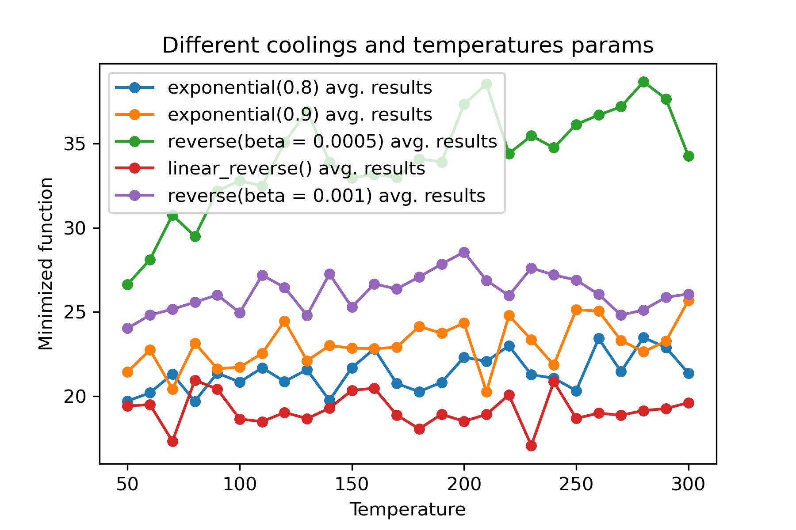


### Multiple coolings

It's amazing feature to **use different coolings and start temperatures for each dimension**:

```python
import math
import numpy as np

from SimplestSimulatedAnnleaning import SimulatedAnnealing, Cooling, simple_continual_mutation


def Rastrigin(arr):
    return 10*arr.size+np.sum(arr**2) - 10*np.sum(np.cos(2*math.pi*arr))

dim = 5


model = SimulatedAnnealing(Rastrigin, dim)

best_solution, best_val = model.run(
    start_solution = np.random.uniform(-5, 5, dim),
    mutation = simple_continual_mutation(std = 1),
    cooling = [ # different cooling for each dimention
        Cooling.exponential(0.8),
        Cooling.exponential(0.9),
        Cooling.reverse(beta = 0.0005),
        Cooling.linear_reverse(),
        Cooling.reverse(beta = 0.001)
        ], 
    start_temperature = 100, 
    max_function_evals = 1000, 
    max_iterations_without_progress = 250, 
    step_for_reinit_temperature = 90,
    reinit_from_best = False
    )

print(best_val)

model.plot_report(save_as = 'different_coolings.png')
```
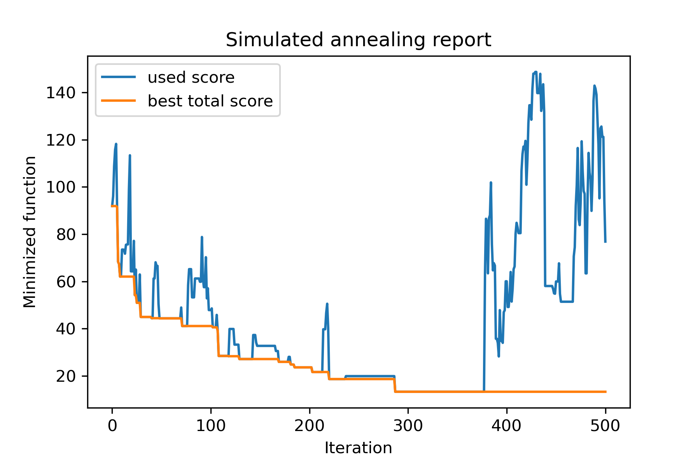

### Give a change to multiple coolings

Main reason to use multiple coolings is the specifying behavior of each dimension. For example, first dimension of space can be much wider than second dimension therefore it's better to use wider search for first dimension; u can produce it using special `mut` function, using different `start temperatures` and using different `coolings`.

Another reason to use multiple coolings is the way of selection: for multiple coolings *selection between good and bad solutions applies by each dimension*. So, it increases chances to find better solution. 

## About mutation

Mutation function is the most important parameter. It determines the behavior of creating new objects using information about current object and about temperature.
I recommend to count these principles when creating `mut` function:

1. mutant solution should be random but "close" to current solution
2. mutant solution usually should be closer as the temperature decreases 

Let's recall the structure of `mut`:

```python
def mut(x_as_array, temperature_as_array_or_one_number):
    # some code
    return new_x_as_array
```
Here `x_as_array` is the current solution and `new_x_as_array` is the mutated solution (random and with same dim, as u remember). Also u should remember that `temperature_as_array_or_one_number` is *number* only for non-multicooling solution. Otherwise (when using several start temperatures of several coolings or both) it is *numpy array*. [See examples](#examples)


# Examples

## Select best subset

In this example I show how to select `k` objects from set with `n` objects which will minimize some function (in this example: absolute value of median):

```python
import numpy as np
from SimplestSimulatedAnnleaning import SimulatedAnnealing, Cooling

SEED = 3

np.random.seed(SEED)

Set = np.random.uniform(low = -15, high=5, size = 100) # all set

dim = 10 # how many objects should we choose

indexes = np.arange(Set.size)
# minimized function -- subset with best |median|
def min_func(arr):
    return abs(np.median(Set[indexes[arr.astype(bool)]]))

# zero vectors with 'dim' ones at random positions 
start_solution = np.zeros(Set.size)
start_solution[np.random.choice(indexes, dim, replace=False)] = 1

# mutation function
# temperature is the number cuz we will use only 1 cooling, but it's not necessary to use it)
def mut(x_as_array, temperature_as_array_or_one_number):
    mask_one = x_as_array == 1
    mask_zero = np.logical_not(mask_one)

    new_x_as_array = x_as_array.copy()
    # replace some zeros with ones
    new_x_as_array[np.random.choice(indexes[mask_one], 1, replace=False)] = 0
    new_x_as_array[np.random.choice(indexes[mask_zero], 1, replace=False)] = 1

    return new_x_as_array

# creating a model
model = SimulatedAnnealing(min_func, dim)

# run search
best_solution, best_val = model.run(
    start_solution = start_solution,
    mutation = mut,
    cooling = Cooling.exponential(0.9), 
    start_temperature = 100, 
    max_function_evals = 1000, 
    max_iterations_without_progress = 100, 
    step_for_reinit_temperature = 80,
    seed = SEED
    )

model.plot_report(save_as = 'best_subset.png')
```
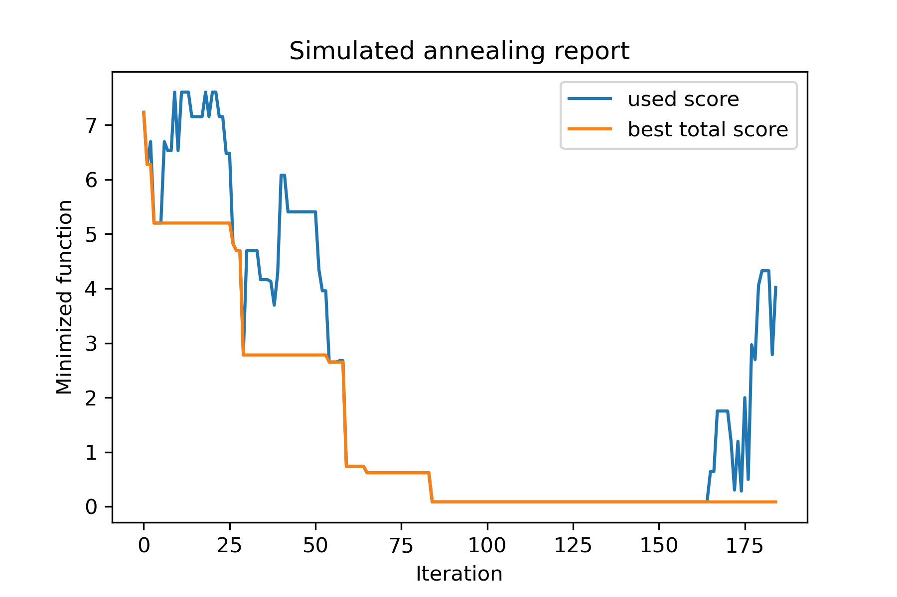

## Travelling salesman problem

Let's try to solve [Travelling salesman problem](https://en.wikipedia.org/wiki/Travelling_salesman_problem) for [berlin52](http://elib.zib.de/pub/mp-testdata/tsp/tsplib/tsp/berlin52.tsp) task. In this task there are 52 cities with coordinates [from file](tests/berlin52_coords.txt).

Firstly, let's import packages:

```python
import math
import numpy as np
import pandas as pd
import matplotlib.pyplot as plt

from SimplestSimulatedAnnleaning import SimulatedAnnealing, Cooling
```

Set seed for reproducing:

```python
SEED = 1
np.random.seed(SEED)
```

Read coordinates and create distance matrix:
```python
# read coordinates
coords = pd.read_csv('berlin52_coords.txt', sep=' ', header= None, names = ['index', 'x', 'y'])

# dim is equal to count of cities
dim = coords.shape[0]

# distance matrix
distances = np.empty((dim, dim))

for i in range(dim):
    distances[i,i] = 0
    for j in range(i+1, dim):
        d = math.sqrt(np.sum((coords.iloc[i, 1:]-coords.iloc[j, 1:])**2))
        distances[i,j] = d
        distances[j,i] = d
```

Create random start solution:
```python
indexes = np.arange(dim)
# some start solution (indexes shuffle)
start_solution = np.random.choice(indexes, dim, replace = False)
```

Define a function which computes the length of way:
```python
# minized function
def way_length(arr):
    s = 0
    for i in range(1, dim):
        s += distances[arr[i-1], arr[i]]
    # also we should end the way in the beggining
    s += distances[arr[-1], arr[1]]

    return s
```

Let's visualize start solution:
```python


def plotData(indices, title, save_as = None):
    
    # create a list of the corresponding city locations:
    locs = [coords.iloc[i, 1:] for i in indices]
    locs.append(coords.iloc[indices[0], 1:])

    # plot a line between each pair of consequtive cities:
    plt.plot(*zip(*locs), linestyle='-', color='blue')
    
    # plot the dots representing the cities:
    plt.scatter(coords.iloc[:, 1], coords.iloc[:, 2], marker='o', s = 40, color='red')    
    plt.title(title)
    
    if not (save_as is None):  plt.savefig(save_as, dpi = 300)

    plt.show()


# let's plot start solution
plotData(start_solution, f'start random solution (score = {round(way_length(start_solution), 2)})','salesman_start.png')
```
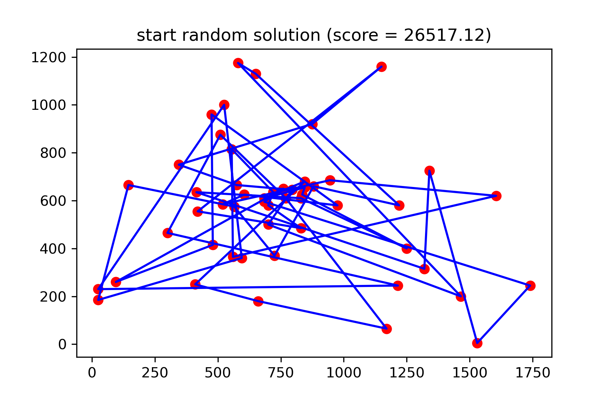

It's really not good solution. I wanna create this mutation function for this task:
```python
def mut(x_as_array, temperature_as_array_or_one_number):
    # random indexes
    rand_inds = np.random.choice(indexes, 3, replace = False)
    # shuffled indexes
    goes_to = np.random.permutation(rand_inds)

    # just replace some positions in the array
    new_x_as_array = x_as_array.copy()
    new_x_as_array[rand_inds] = new_x_as_array[goes_to]

    return new_x_as_array
```

Start searching:
```python
# creating a model
model = SimulatedAnnealing(way_length, dim)

# run search
best_solution, best_val = model.run(
    start_solution = start_solution,
    mutation = mut,
    cooling = Cooling.exponential(0.9), 
    start_temperature = 100, 
    max_function_evals = 15000, 
    max_iterations_without_progress = 2000, 
    step_for_reinit_temperature = 80,
    reinit_from_best = True,
    seed = SEED
    )

model.plot_report(save_as = 'best_salesman.png')
```
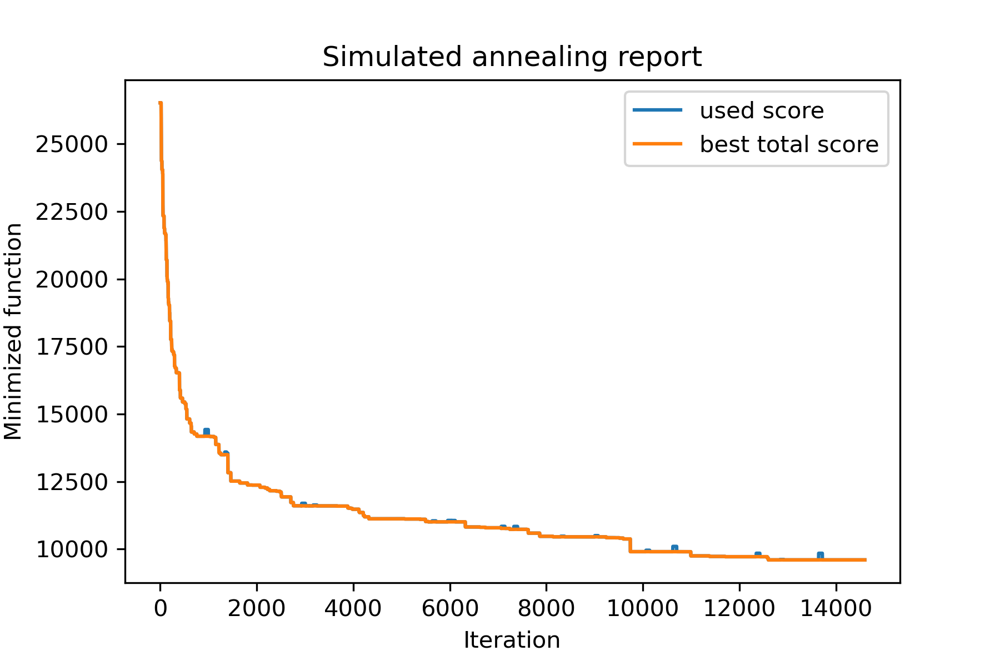

And see our so much better solution:
```python
plotData(best_solution, f'result solution (score = {round(best_val, 2)})','salesman_result.png')
```
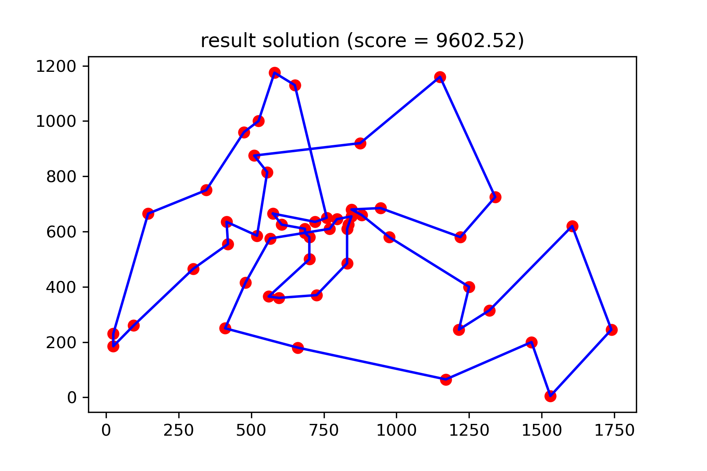

